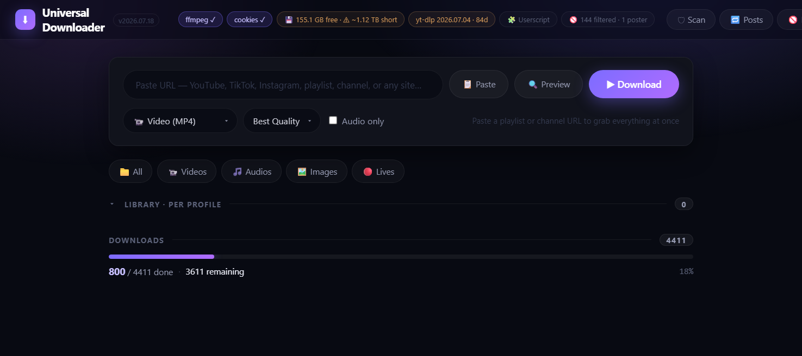

<div align="center">


# Universal Downloader

**A local Flask + yt-dlp media downloader with a browser userscript that sends links straight to it.**
Batch queue with priority tiers, disk-fit checks, title/poster blocklists, integrity verification, and one-click grabbing from your browser — including Twitter/X.


by **[ELO (Ghost999-dot)](https://github.com/Ghost999-dot)**

</div>

<p align="center"></p>

> **Heads-up:** this repo is the **app source only**. Your runtime data — `config.json`, `server_state.json`, `cookies.txt`, `telegram.session`, the `downloads/` folder — is git-ignored and never published. Start from `config.example.json`.

---

## What it does

- **Local download server** on `http://127.0.0.1:9898` that takes a URL and downloads it with **yt-dlp** (video/audio/images), naming and foldering by creator.
- **Kill-able child-process workers** — each download runs in its own process the parent can cancel cleanly; a configurable worker pool (`max_workers`) with **priority tiers** (single posts jump ahead of big profile scrapes).
- **Browser userscript** (`userscript.user.js`) that adds a grab bubble / right-click / hotkey on allow-listed sites **and** one-click download buttons on **Twitter/X**, routing everything to the app.
- **Smart queue extras:** disk-space fit check before large queues, duplicate/dedup handling, title keyword + whole-word blocklists, per-poster blocklist, picture-only-album skipping, and post-download **integrity verification** with auto-heal.
- **Optional Telegram push** (Telethon user session, 2 GB limit) to mirror finished files to a chat.
- Ships as a single **PyInstaller** `--onefile --windowed` exe.

## Repository layout

| Path | What |
|------|------|
| `source/server.py` | the whole Flask backend + download engine |
| `source/static/index.html` | the web UI (served live; no rebuild for UI tweaks) |
| `source/launcher.py` | PyInstaller entry point |
| `source/icon.ico` | app icon |
| `source/Build EXE.bat` | one-shot build helper |
| `userscript.user.js` | the browser userscript (Grabber + Twitter) the app serves at `/userscript.user.js` |
| `ud-icon.svg` | the logo |
| `config.example.json` | copy to `config.json` and edit |

## Run from source

```bash
cd source
pip install flask yt-dlp curl_cffi telethon
python launcher.py
```
Then open <http://127.0.0.1:9898>.

## Build the exe (Windows)

```bat
cd source
python -m PyInstaller --clean --noconfirm --onefile --windowed ^
  --name "Universal_Downloader" --icon "icon.ico" ^
  --add-data "static;static" --add-data "icon.ico;." ^
  --collect-all yt_dlp --collect-all curl_cffi --collect-all telethon ^
  "launcher.py"
```
Copy `dist/Universal_Downloader.exe` next to your `config.json` and run it.
> The frontend is served **live** from `source/static/index.html`, so HTML/JS tweaks don't need a rebuild — only backend (`server.py`) changes do.

## The userscript

Install once from the running app:

```
http://127.0.0.1:9898/userscript.user.js
```

- **Allow-listed sites** (edit in the Tampermonkey menu): a floating ⬇ bubble, plus Shift/Alt/Ctrl + Right-Click to send video / audio / image, and **Alt+Shift+D** to toggle a site.
- **Twitter/X:** download buttons on tweets, per-image, and in the media tab — it resolves the media in your logged-in session and POSTs each file to the app.

## Config

Copy `config.example.json` → `config.json`. Notable keys:

| Key | Meaning |
|-----|---------|
| `max_workers` | parallel downloads (rate-limited sites 403 if too high) |
| `block_keywords` / `block_words` | title filters (substring / whole-word) |
| `block_posters` | creators to skip entirely |
| `skip_image_only_albums` | don't queue albums that have zero videos |
| `verify_after_download` / `verify_auto_heal` | integrity scan + re-download broken files |
| `telegram_api_id` / `telegram_api_hash` / `telegram_chat` | optional Telegram mirroring (leave blank to disable) |

## HTTP API (localhost only)

`POST /api/download` `{url, format, audio_only, quality}` · `GET /api/jobs` · `GET /api/info` · `POST /api/jobs/cancel_all` · `POST /api/blocklist` · … (see `server.py`).

## License

MIT — © 2026 ELO (Ghost999-dot). See [LICENSE](LICENSE).
